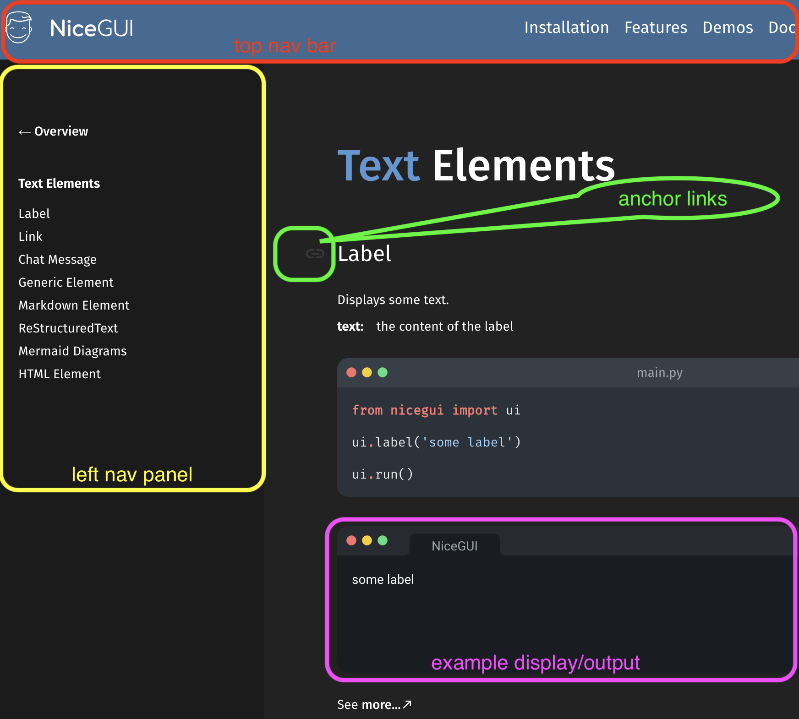

# NiceGUI-primer

This project provides the plain text primer version of NiceGUI's documentation for usage with AI or as a portable offline file. 

Why? 

- NiceGUI is new compared to the cut-off training dates of many AI LLM's
- While impressive for humans, being a dynamically created website for documentation 
and all; a text file is smaller, faster, easier to ingest by AI's

The [primer for NiceGUI](https://chatgpt.com/g/g-n2O45ylVT-nicegui-primer) is 
available for use as a GPT on OpenAI's GPT store. While it's offered by me 
as a free to use tool; you may have to setup a ChatGPT account (maybe $'s). Also, it's 
not just limited to chatting about NiceGUI, the GPT is backed by GPT-4 so it 
can be used for any typical chat activities and capable of coding in Python.
> It turns out that there are several existing GPT's being offered regarding NiceGUI, see: [Exploring GPTs](https://chatgpt.com/gpts).

Further information here:
- https://nicegui.io/
- https://nicegui.io/documentation
- https://github.com/zauberzeug/nicegui/
- https://github.com/zauberzeug/nicegui/blob/main/CONTRIBUTING.md#documentation

---


## 1. Install NiceGUI's documentation website for scraping

To avoid disturbing the nicegui.io online server, let's run the nicegui documenation website at: \
http://localhost:8080/ by doing the following:

> By the way, this was a very thoughtful option for the NiceGUI project to offer, so why not use it.

Clone the github repo or download the zip file:
```sh 
git clone nicegui
```

```sh
cd nicegui
```

Setup a virtual environment using conda or something:

```sh
conda create -n nicegui python=3.10
```

```sh
conda activate nicegui
```

Perhaps not all of the following are actually required, but this works:

```bash
python3 -m pip install -e .
```

```sh 
pip install itsdangerous prometheus_client isort docutils pandas plotly pyecharts matplotlib requests dnspython
```

Now launch `main.py` in the root directory:

```sh 
python -B main.py
```

---
  

## 2. Install NiceGUI-primer

Clone the github repo or download the zip file:
```sh
git clone https://github.com/cleesmith/NiceGUI-primer.git
```

```sh
cd NiceGUI-primer
```

Setup a virtual environment using conda or something:
> Also, other python versions may work, but I used 3.10.14:

```sh
conda create -n NiceGUI-primer python=3.10
```

```sh
conda activate NiceGUI-primer
```

---


## 3. Scrape NiceGUI documentation

Collect a list of the scrapable urls using Playwright with the Chromium option

```sh
cd NiceGUI-primer
```

```sh
pip install playwright
```

```sh
python -B 1_get_all_urls.py
```

---


## 4. Scrape using the list of urls into a text file
> This process also uses Playwright with the Chromium option

```sh
cd NiceGUI-primer
```

```sh
python -B 2_scrape_all_urls.py
```

---


## 5. Scrape using the list of urls into a PDF file
> Again, this process also uses Playwright with the Chromium option

<div style="border: 2px solid red; padding: 10px; border-radius: 5px;">
  <strong style="color: red;">⚠️ WARNING:</strong> 
  While this code works to create a PDF file, it is just too big to be
  useful with AI's as they exist in August 2024. But your mileage may vary.
</div>

```sh
cd NiceGUI-primer
```

```sh
python -B 3_scrape_to_pdf.py
```

---


# Thoughts

<blockquote style="font-size: 3em;">
  First and foremost, the state of AI in August 2024 can make one wonder 
  about the <i>"I"</i> (<i>intelligence</i>) in AI, <br>
  and this tiny project 
  really seems like overkill just to help the <i>"I"</i> understand.
</blockquote>

The online [NiceGUI documentation](https://nicegui.io/documentation) is great for 
humans, but not so great for AI. 

And the scraping process is affected by:
1. repeated links due to the navigation, which is helpful to humans; 
see #1 and #2 in the screenshot below
2. so many anchor links, such as: 
https://nicegui.io/documentation/section_text_elements#label 
i.e. it's the #label thing, and there are a lot of them in the doc's; 
see #3 in the screenshot below
3. the <i>example display/output</i> shown by executing the example code; 
see #4 in the screenshot below
> This example code, regardless of how it's executed, impacts page load time.

After digging around in the source code, there are ways to turn off #1 and 
#2 (the nav bars) but there was no easy way found to stop #3 (anchor links) 
and #4 (code example display/output). 

Perhaps these changes are not possible, or just too much to ask of any project, 
but a <br>
<i>**command line arg**</i> such as: <i>**--nonhuman**</i> <br>
would certainly help with the scraping of the doc's to be feed to AI's  
in removing all 4 of the troublesome spots, like so:

```sh
cd nicegui
python -B main.py --nonhuman
```



---

## A personal pet peeve (a mild one)

### Oh those first impressions

> See ~/nicegui/main.py:

```python
NOTE: do not reload on fly.io (see https://github.com/zauberzeug/nicegui/discussions/1720#discussioncomment-7288741)
ui.run(uvicorn_reload_includes='*.py, *.css, *.html', reload=not on_fly, reconnect_timeout=10.0)
```
> Sure it executes just fine, but to exit requires a **ctrl-c** and then one sees:

```sh
(nicegui) booboobear:~$ python -B main.py   
NiceGUI ready to go on http://localhost:8080, and http://192.168.0.8:8080
^C%                                                                                                 
(nicegui) booboobear:~$ /opt/miniconda3/envs/nicegui/lib/python3.10/multiprocessing/resource_tracker.py:224: 
UserWarning: resource_tracker: There appear to be 6 leaked semaphore objects to clean up at shutdown
warnings.warn('resource_tracker: There appear to be %d '
```
> What is all of that about?

So let's add a tiny bit of code to catch the **ctrl-c**:

```python
if __name__ == "__main__":
    try:
        # just say no to reload
        ui.run(reload=False, reconnect_timeout=10.0, show_welcome_message=False, title="NiceGUI documentation")
    except KeyboardInterrupt:
        print(f"\nShutting down NiceGUI documentation server . . .", end=" ")
        app.shutdown() # is not required but feels logical and says it all
    finally:
        print("catch you later!")
```

And now, so nice, so clean:

```sh
cd nicegui
python -B main.py
^C
Shutting down NiceGUI documentation server . . . catch you later!
```

> I know, TMI, right?

---

<h1 align="center">fin</h1>

---

